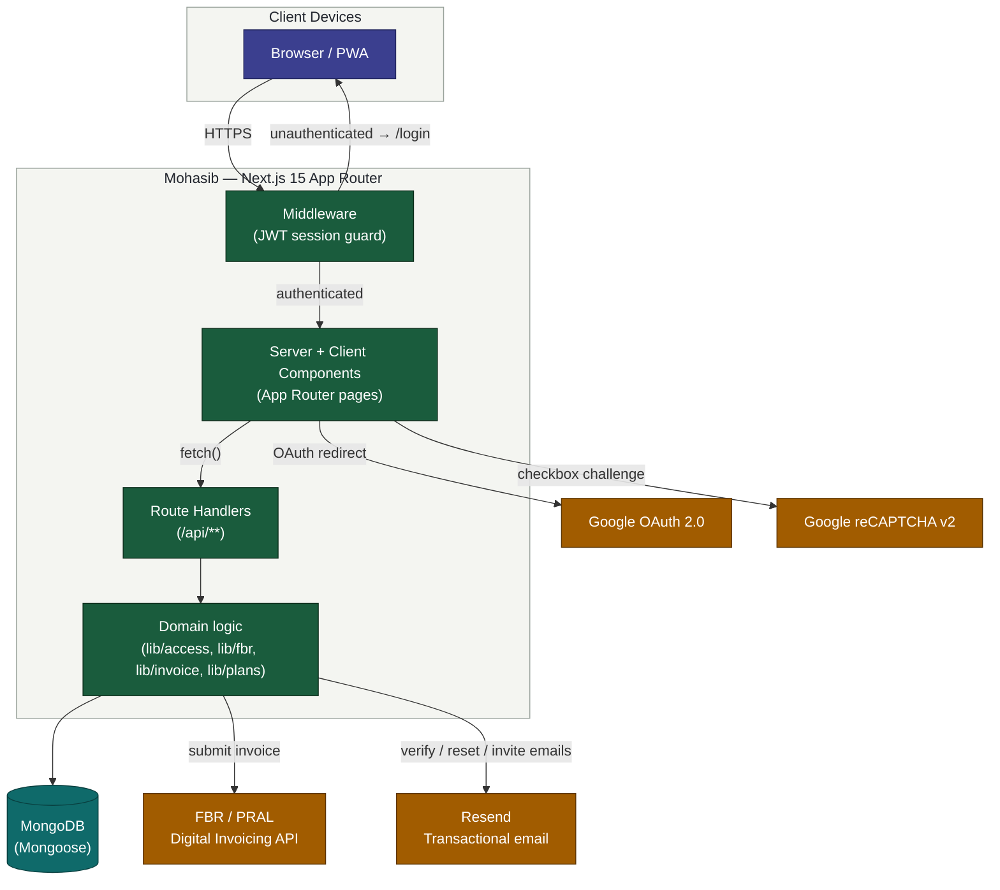
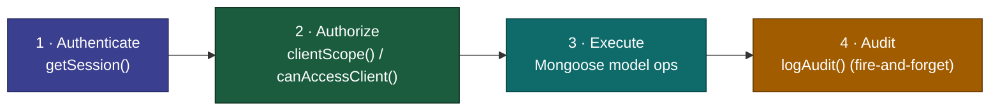
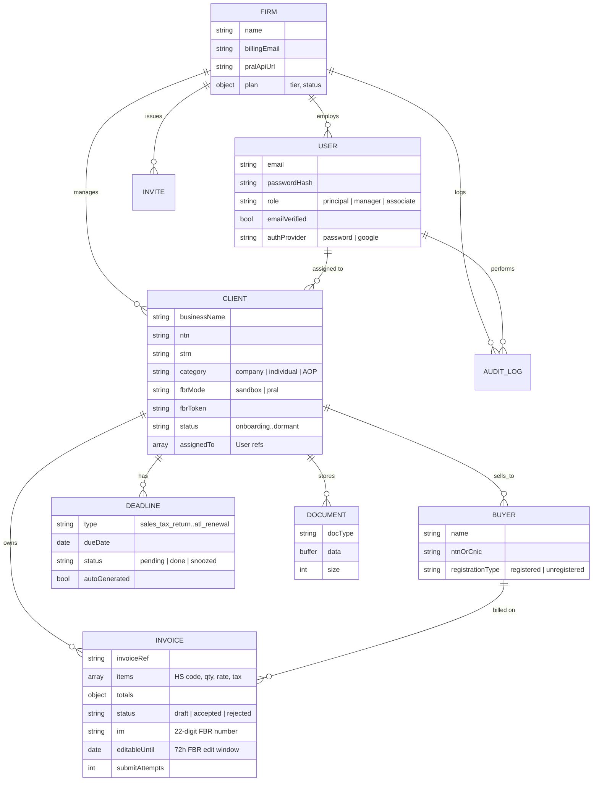
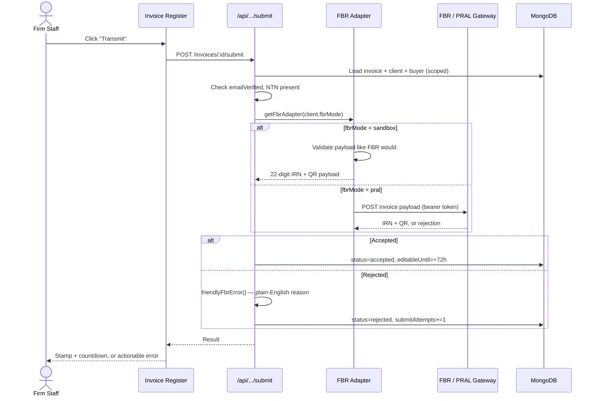
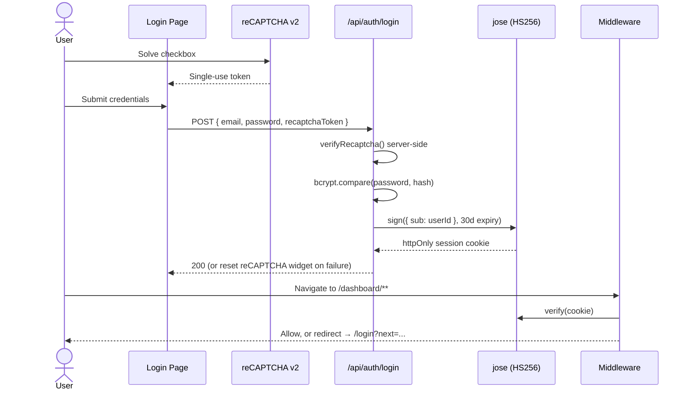

<div align="center">

# Mohasib

### FBR Digital Invoicing & Compliance Workspace for Tax Consultancy Firms

Multi-tenant SaaS that lets a tax consultancy firm onboard, invoice, and stay compliant for every SME client it manages — from one dashboard, in English or Urdu.

[](https://nextjs.org/)
[](https://react.dev/)
[](https://www.typescriptlang.org/)
[](https://mongoosejs.com/)
[](https://tailwindcss.com/)
[](#)
[](#license)

[Overview](#overview) · [Architecture](#architecture) · [Data model](#data-model) · [Security](#security-model) · [Getting started](#getting-started) · [API](#api-reference)

</div>

---

## Overview

Pakistan's FBR mandated real-time digital invoicing for sales-tax registered persons (Chapter XIV, Sales Tax Rules 2006). Every registered business now has to transmit invoices to PRAL in real time and faces Section 33 penalties for non-compliance. **The people actually doing this work are tax consultancy firms managing 20–200 client businesses at once** — not the businesses themselves.

Mohasib is built for that firm, not for a single business:

- A **principal** signs up once, invites their **staff** (managers/associates), and assigns each staff member a subset of clients they're responsible for.
- Every **client** is a distinct SME with its own NTN/STRN, its own FBR sandbox-or-live connection, its own buyers, invoices, deadlines, and document vault.
- The firm sees, in one command-centre dashboard, exactly what's on fire today across its *entire* book of clients — rejected invoices, closing 72-hour edit windows, upcoming filing deadlines — not just one business's numbers.

This is the difference between "an invoicing app" and "the tool a consultancy runs its practice on."

---

## Architecture

### System context



<sub>🟪 Client-side · 🟩 App internals (Next.js) · 🟦 Data store · 🟧 External third-party services</sub>

### Layered request flow

The app follows a strict layering discipline — every API route repeats the same four steps, which is what makes 40+ endpoints auditable at a glance:



No route trusts a client-supplied `firmId` or `clientId` — every query is pre-scoped server-side from the signed session before it ever touches the database.

---

## Data model

Five years ago this would've been "one business, its customers, its invoices." Real consultancy practice needs a firm-level tenant sitting above all of it:



**The one semantic decision that shapes everything else:** `Client` is the *managed SME* (the firm's paying client), and `Buyer` is that SME's own customer. Get this backwards and the whole RBAC model falls apart — every access-control check in the app hinges on scoping by `Client`, not by `Buyer`.

---

## Key flows

### Invoice transmission to FBR



Every rejection is translated from raw FBR error text into something a junior accountant can act on immediately (`lib/fbr/errors.ts`) — no decoding FBR error codes.

### Authentication & session



A reCAPTCHA v2 token is single-use by design — the client resets the widget after *any* failed submit so it never silently resends a dead token.

---

## Tech stack

| Layer | Choice | Why |
|---|---|---|
| Framework | **Next.js 15** (App Router) | Server + client components in one tree; route handlers double as the API layer with zero extra infra |
| Language | **TypeScript 5** | End-to-end type safety from Mongoose schema → API response → React props |
| UI | **React 19**, **Tailwind CSS 4** | Utility-first styling with a hand-built design system (`.card`, `.stamp`, `.ledger`) rather than a generic component kit |
| Database | **MongoDB + Mongoose 8** | Flexible schema for a domain with firm-specific line-item variability; connection caching for serverless cold starts |
| Auth | **jose (JWT)** + **bcryptjs** | Stateless httpOnly session cookies, HS256-signed; fails loudly in production if `JWT_SECRET` is missing rather than falling back to a guessable default |
| Bot protection | **Google reCAPTCHA v2** | Checkbox challenge on login/register/forgot-password, server-verified |
| OAuth | **Google Sign-In** | First-time Google login auto-provisions a firm + principal account |
| Email | **Resend** | Transactional email for verification, password reset, staff invites — degrades to console logging in local dev with zero code changes |
| CSV | **PapaParse** | Bulk client onboarding and bulk invoice import from a firm's existing sales register |
| QR/PDF | **qrcode** | Client-side QR generation for the FBR-compliant printable invoice |
| PWA | Custom service worker + manifest | Installable app, offline shell fallback, app-only caching (API responses are always network-fresh) |
| E2E | **Playwright** | Available for browser-level verification of critical flows |

---

## Feature highlights

### Multi-tenancy & access control
- Firm → staff (principal / manager / associate) → client → buyer → invoice hierarchy, enforced at the query layer, not just the UI
- Managers/associates only ever see clients in their own `assignedTo` list — verified server-side on every request via `clientScope()`
- Plan-based client limits (trial → starter → growth → scale) enforced at creation time, not just displayed

### FBR compliance engine
- Pluggable adapter pattern (`FbrAdapter` interface) — swap sandbox for live PRAL with one field, per client
- Sandbox adapter replicates FBR's own validation rules so firms can rehearse the entire flow with zero credentials
- 72-hour post-acceptance edit/cancel window tracked with a live countdown
- Plain-English rejection reasons instead of raw FBR error codes
- Auto-generated compliance calendar per client (sales tax returns, withholding statements, income tax, ATL renewal) with snooze/done/reassign

### Operational tooling
- Firm-wide "command centre" dashboard: today's fires, this week's deadlines, red/yellow/green client health, staff filter
- ⌘K / Ctrl+K command palette to jump between clients instantly
- Bulk CSV import for both client onboarding and invoice registers
- Inline document vault (NTN/STRN certs, CNICs, bank letters, FBR notices) with retention metadata
- Append-only audit log across every mutating action

### Security posture
- Production boot-time guards: the app refuses to start with a missing/weak `JWT_SECRET` or missing `MONGODB_URI` rather than silently degrading
- Password reset and email verification via single-use, time-boxed tokens (`AuthToken` model)
- reCAPTCHA v2 server-side verification with correct single-use-token handling
- Every mutating route is session-authenticated *and* tenant-scoped before touching the database

---

## Project structure

```
src/
├── app/
│   ├── api/                  # Route handlers — the entire backend API surface
│   │   ├── auth/             # login, register, logout, verify, reset, forgot, google OAuth
│   │   ├── clients/[id]/     # SME CRUD, buyers, invoices, deadlines, documents (nested, scoped)
│   │   ├── firm/             # firm profile, staff management
│   │   └── stats/            # dashboard aggregation
│   ├── dashboard/            # Authenticated app shell (client-scoped workspace)
│   │   └── clients/[id]/     # per-client workspace: invoices, buyers, deadlines, documents, settings
│   ├── tools/                # Public, no-login SEO tools (penalty calculator, IRN checker)
│   └── (public)               # Landing, login, register, forgot/reset, invite-accept
├── components/                # Reusable UI: Button (async-aware loading state), Recaptcha, CommandSwitcher…
├── lib/
│   ├── access.ts              # Session resolution + RBAC scoping — the security core
│   ├── fbr/                   # Adapter pattern: sandbox mock + live PRAL client + error translation
│   ├── invoice.ts              # Tax math (line totals, VAT/ST computation)
│   ├── deadlines.ts            # Compliance calendar generation logic
│   ├── plans.ts                 # Subscription tier definitions
│   ├── email.ts / verify.ts      # Resend integration + token issuance
│   └── env.ts                    # Fail-fast production environment guards
├── models/                     # 10 Mongoose schemas — see Data Model above
└── middleware.ts                # Edge-runtime JWT gate for /dashboard/**
```

---

## Getting started

### Prerequisites
- Node.js 18+
- A MongoDB instance (Atlas free tier works)

### Setup

```bash
git clone <repo-url>
cd mohasib-fbr-invoicing
npm install
cp .env.example .env   # fill in at least MONGODB_URI and JWT_SECRET
npm run dev             # http://localhost:3000
```

### Environment variables

| Variable | Required | Purpose |
|---|:---:|---|
| `MONGODB_URI` | ✅ | Database connection string |
| `JWT_SECRET` | ✅ | Session signing secret — app refuses to boot in production without a strong value |
| `APP_URL` | ✅ | Base URL used in transactional email links |
| `RESEND_API_KEY` / `EMAIL_FROM` | – | Enables real email delivery (verification, reset, invites); logs to console otherwise |
| `NEXT_PUBLIC_RECAPTCHA_SITE_KEY` / `RECAPTCHA_SECRET_KEY` | – | Enables the reCAPTCHA checkbox; skipped when unset |
| `NEXT_PUBLIC_GOOGLE_CLIENT_ID` / `GOOGLE_CLIENT_SECRET` | – | Enables "Continue with Google"; button hidden when unset |
| `PRAL_API_URL` | – | Fallback FBR live endpoint (can also be set per-firm in-app) |

Every optional integration degrades gracefully — the app is fully usable in local dev with only the two required variables set.

### Going live with FBR
1. Register as a licensed integrator via the FBR IRIS portal and obtain sandbox credentials.
2. Pass FBR's scenario testing in sandbox mode.
3. Set the production PRAL endpoint (Firm → Settings) and paste each client's bearer token on that client's own Settings page.
4. Flip that client's FBR connection from **Sandbox** to **Live**.

Full step-by-step guidance is built into the app itself (Firm Settings → "How do I get PRAL API credentials?").

---

## API reference

All routes are session-authenticated and tenant-scoped unless marked public. Full request/response contracts live in the route handlers themselves (`src/app/api/**/route.ts`).

| Method & path | Purpose |
|---|---|
| `POST /api/auth/register` | Create firm + principal account |
| `POST /api/auth/login` | Email/password sign-in (reCAPTCHA-gated) |
| `GET /api/auth/google` → `.../callback` | Google OAuth sign-in / auto-provision |
| `POST /api/auth/forgot` · `POST /api/auth/reset` | Password reset flow |
| `POST /api/auth/verify` · `PUT /api/auth/verify` | Confirm / resend email verification |
| `GET/POST /api/clients` · `GET/PATCH/DELETE /api/clients/:id` | Managed-SME CRUD |
| `POST /api/clients/import` | Bulk client onboarding from CSV |
| `GET/POST /api/clients/:id/buyers` | SME's own customer directory |
| `GET/POST /api/clients/:id/invoices` · `POST .../import` | Invoice register + bulk import |
| `POST /api/clients/:id/invoices/:invId/submit` | Transmit to FBR sandbox/live |
| `GET/POST /api/clients/:id/deadlines` · `PATCH /api/deadlines/:id` | Compliance calendar |
| `GET/POST /api/clients/:id/documents` | Document vault |
| `GET /api/firm` · `PATCH /api/firm` | Firm profile, plan tier, PRAL endpoint |
| `GET/POST /api/firm/staff` · `PATCH .../:id` | Staff management + invites |
| `GET /api/stats` | Dashboard aggregation (health, fires, this-week) |
| `GET /api/audit` | Firm activity log (principal only) |

---

## Roadmap & known limitations

Being upfront about what's real vs. what's an MVP stand-in:

- **Billing** — plan tiers and client-limit enforcement are real; there is no payment gateway wired yet (tier switch updates the limit but doesn't charge)
- **Deadline reminders** — surfaced in-app and on the dashboard, but not yet dispatched via email/WhatsApp
- **Document storage** — inline in MongoDB (8 MB/file cap) — fine at current scale, would move to S3/GridFS before high volume
- **PRAL adapter** — follows the published Digital Invoicing API shape; field names should be re-verified against the live spec before first production transmission, since FBR revises the spec periodically

---

## License

Proprietary — all rights reserved. Not licensed for redistribution.
